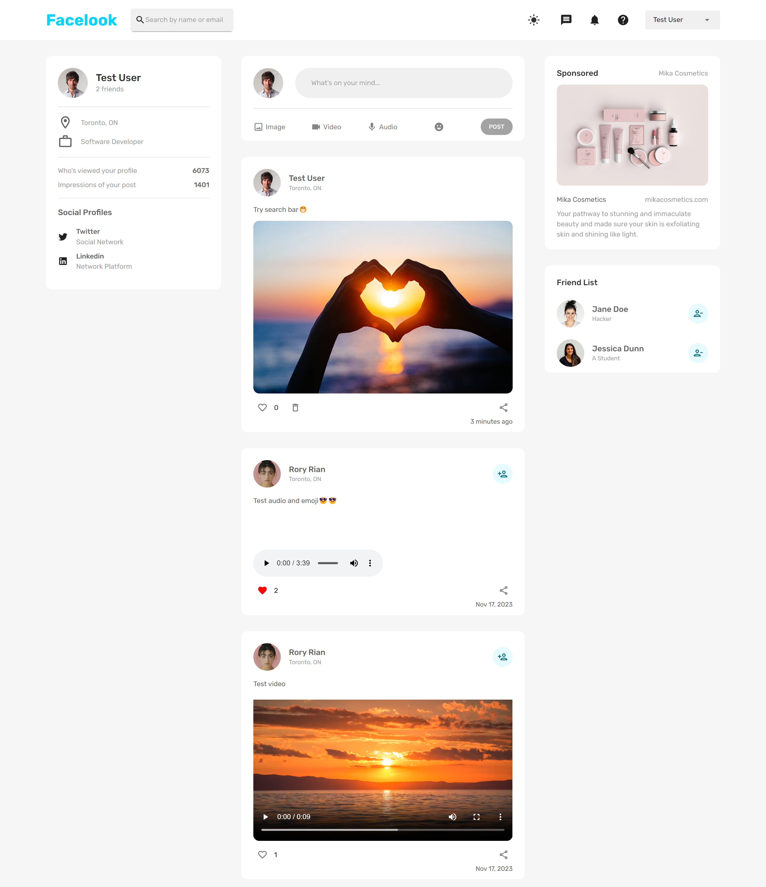

# Facelook

### Description

Facelook is a social media platform that places a strong emphasis on user security and interactive engagement. It
utilizes JWT for secure authentication and Bcrypt for password encryption to ensure the protection of user data. Users
can easily register, create diverse content, and interact through features like likes, shares, and comments. The
platform also offers efficient friend management and user search functionalities for seamless connections. Facelook's
responsive design ensures optimal viewing on any device, and a user-friendly dark mode is available for enhanced
accessibility.

### Technologies Used

- React.js
- Express.js
- MongoDB
- Redux
- Material UI
- Multer
- JWT
- Bcrypt

### Key Features

- **Registration:** Allows users to register by providing their name, location, occupation, profile picture, email, and
  password.
- **Login:** Enables users to log in using their email and password.
- **Authorization:** Utilizes JWT for secure authorization and access control within the application.
- **Password Encryption:** Uses Bcrypt for secure password hashing, ensuring encrypted storage in the database and
  protection against unauthorized access.
- **Post Management:** Enables users to create posts using text, emojis, images, audio, and video, with each post
  showing its posted time. Additionally, it offers the flexibility to delete posts as needed.
- **Interactive Engagement:** Enables users to interact through features like likes, shares, and comments.
- **Friend Management:** Implements features that allow users to effortlessly add or delete friends.
- **User Search:** Enables users to easily find and connect with other users.
- **Responsive Design:** Supports various screen sizes for an optimal user experience across devices.
- **Dark Mode:** Integrates a dark mode option into the user interface for enhanced comfort and accessibility, allowing
  users to customize their viewing experience.

### Screenshots

- **Registration Page**

  

- **Login Page**

  

- **Home Page**

  
  

- **Profile Page**

  

- **Mobile Version of Home Page**

  